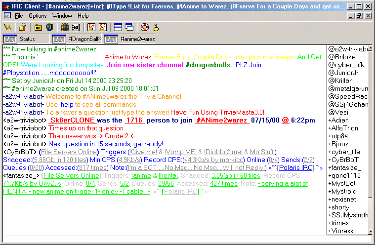



## mIRC Clone, IRC Client \- UPDATED

### Description

Ok, I finally have colors working, I got Ident Server working as well, I started on a taskbar and DCC, just about done.. I want to add scripting support next, If you want to help, my ICQ# is 52567840...
 
### More Info
 

             |
---                |---
**Submitted On**   |2000-07-15 19:49:04
**By**             |[Wanna\-Sk8er](https://github.com/Planet-Source-Code/PSCIndex/blob/master/ByAuthor/wanna-sk8er.md)
**Level**          |Advanced
**User Rating**    |4.1 (62 globes from 15 users)
**Compatibility**  |VB 3\.0, VB 4\.0 \(16\-bit\), VB 4\.0 \(32\-bit\), VB 5\.0, VB 6\.0, VB Script, ASP \(Active Server Pages\) 
**Category**       |[Complete Applications](https://github.com/Planet-Source-Code/PSCIndex/blob/master/ByCategory/complete-applications__1-27.md)
**World**          |[Visual Basic](https://github.com/Planet-Source-Code/PSCIndex/blob/master/ByWorld/visual-basic.md)
**Archive File**   |[CODE\_UPLOAD78237152000\.zip](https://github.com/Planet-Source-Code/wanna-sk8er-mirc-clone-irc-client-updated__1-9794/archive/master.zip)

